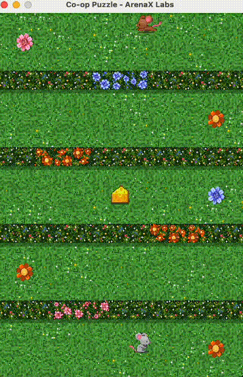

# ArenaX COOP challenge 

## 📌 About the Challenge

In this task, a reinforcement learning algorithm was to be designed with focus on cooperation, exploration and sparse rewards. 

### ✅ Success Criteria
1. Two mice must reach the cheese together for the episode to be considered successful.
2. Some gates block the path to the cheese. To open these gates, at least one mouse must interact with a specific flower.
3. Players must switch between the two mice strategically, helping each other navigate obstacles and progress toward the cheese.

### 🛠 Environment information 

* Map Size - Grid of size `19x13`
* State Space - A matrix of `19x13x13` where each channel represents different elements of the grid, like position of mouse, cheese, walls and shrubs encoded to either -1 or 1.
* Action Space - Integer value between 0 and 9, each mapped to a direction in which a mouse can move and 9 is used to switch between the two.
* Reward - 1 if both the mice reaches the cheese, else 0. 

## 🚀 Approaches - 

### Behaviour Cloning - 

To address the sparse reward issue, I first applied Behavior Cloning (BC). The goal was to learn a policy by imitating expert demonstrations rather than relying solely on reward signals. Here’s what I did:

1. *Data Collection*: I manually played the game and recorded my actions to create demonstration trajectories. These demonstrations consisted of both desired behaviors and recovery actions when the mouse encountered an undesired scenario.

2. *Training*: A supervised learning model was trained to predict the next action based on the current state, effectively mimicking expert decisions.

3. *Results*: The BC-trained model successfully solved the task with a **success rate of 50%**.

<p align="center">
  
</p>

However, it did not learn meaningful representations as expected, which was evident in the failure cases observed in this video.

<p align="center">
  
</p>

Why Did It Fail? 🤔

Behavior Cloning has inherent drawbacks that limit its effectiveness in complex RL tasks:

1. 🔍 *Lack of Exploration*: Since BC is a supervised learning approach, the agent only learns from recorded demonstrations and does not explore novel situations. This is problematic in environments where exploration is necessary for success.

2. ⚠️ *Compounding Errors*: If the agent deviates slightly from the expert trajectory, it has no mechanism to recover since it has not seen those states during training.

3. 📊 *Data Dependence*: The model's performance is highly dependent on the quality and diversity of the demonstrations. If the dataset does not cover all possible scenarios, the agent struggles in unseen situations.

4. 🏆 *No Reward Utilization*: Unlike reinforcement learning, BC does not leverage reward signals, meaning it cannot refine its policy based on actual performance outcomes.

### Fine Tuning BC Policy using RL - 

Given the limitations of BC, I attempted to fine-tune the learned BC policy using RL. The idea was that since BC already provided a reasonable policy, fine-tuning with RL could help generalize and improve performance beyond the demonstrated trajectories. To achieve this, I used Proximal Policy Optimization (PPO), a popular policy-gradient-based RL algorithm.


#### Initial Fine-Tuning Attempt: Failure Case 🚨

When fine-tuning the BC policy using PPO, I observed a significant degradation in performance instead of an improvement. The success rate, which was **initially 50% with BC**, dropped drastically to **~0%**. 😞

<p align="center">
  
</p>


The reason lies in how PPO and other RL algorithms learn. RL relies on an actor-critic setup where the **critic network estimates the value function and guides policy updates**. However, BC training only provides policy weights—it does not train a critic. So, when PPO was applied directly, the lack of a trained critic led to unstable and destructive updates

#### A Better Approach: Two-Stage Fine-Tuning

To address this, I followed a method in which a two-stage RL fine-tuning strategy was used:

* *Phase 1 - Critic Learning Only*:
    1. The BC policy was frozen, and RL was used to train only the critic network.
    2. The weights of the critic network were initialized to be as close to zero as possible. 
    3. This ensured that the critic learned a stable value function before influencing policy updates.
    4. During this phase, rollouts were generated using the BC policy, and the critic was trained until the loss plateaued.

* *Phase 2 - Joint Training with Warmup*:
    1. Once the critic had learned a stable value function, the policy was unfrozen.
    2. The learning rate for the critic was decayed, while a warmup schedule was used for the policy updates.
    3. This gradual transition helped avoid drastic changes that could destabilize training.

* Results 🎉
    1. Phase 1: After training just the critic, the **success rate increased from 50% to 61%**.
    2. Phase 2: Joint training with warmup further improved the success rate to an **average of 75%**.

I created a custom PPO class `CoopPPO` to handle seperate optimizers adn lr schedulers for policy and critic networks (implementation in `src/models` folder). 

#### Future Steps/Potential Solutions

1. Since the state space for this environment is a 3D matrix, CNN networks can be used in the policy to train both BC/RL. Codes for the same are present in `src/networks` folder of this project and have been integrated with the approaches. However the results are still not in yet. This is has been integrated with just BC. To train the fintuning pipeline, for now only standard policies can be used. 
2. Other algorthms which combine IL and RL together like SoftQ Imitation Learning (SQIL) can be explored (the implementation for which is in `src/models` folder). I am currently training that algorithm and debugging my code for any potential issues that might hamper training. 

## 📂 Project Structure
```
ArenaX_Tech/
│── algorithms/               # Source code for RL and IL classes
│── config/                   # Config YAML files to setup models
│── data/                     # Training data & expert demonstrations
│   │── models/                   # Trained models
│   │── trajectories/             # Demonstrations for IL
│── src/                      # Source code for necessary functions/classes
│── runnables/                # scripts to train RL and IL models
│── test/                     # scripts to test RL and IL models
│── requirements.txt          # Dependencies
```

## 🔧 Setup & Installation
```bash
# Clone the repository
git clone https://github.com/Shaswat2001/arenaX_tech.git
cd arenaX_tech

# Create a virtual environment and install dependencies
conda activate sai
pip install -r requirements.txt
```

## ▶️ Running the Code

### Train the Model
```bash
python runnables/train_imitation.py --config "config/train_bc.yaml" # Train using Behavior Cloning
python runnables/train_reinforcement.py # Fine-tune with Reinforcement Learning
```

All the parameters related to training the IL and RL models can be found in `config` folder. The individual YAML files can be changed based on requirements. 

### Test the Model
```bash
python test/test_imitation.py # Test Behavior Cloning
python test/test_rl.py  # Test Reinforcement Learning
```
